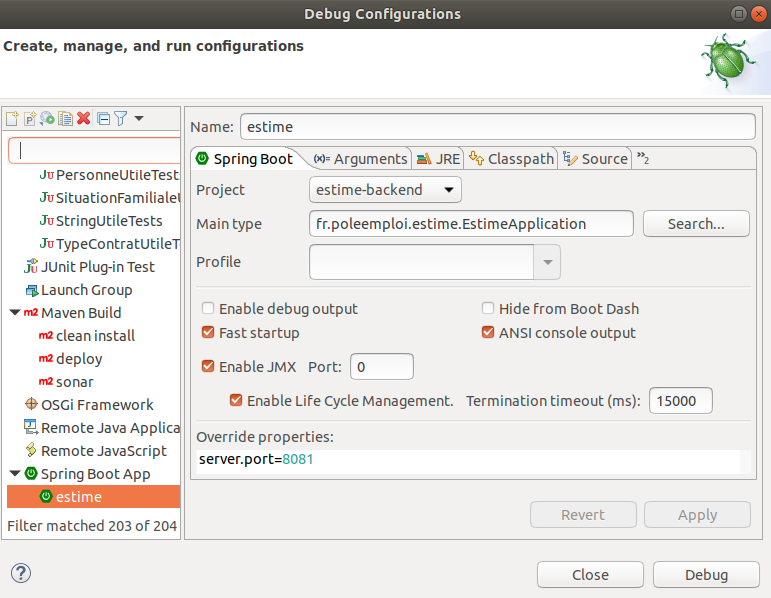

:gb: [English version](https://github.com/StartupsPoleEmploi/estime-backend/blob/333fd0f4cbbc5484f8814d685ea8e919eb6389ba/README_EN.md)

# [Startups Pôle emploi] Estime - simulateur d'prestations à la reprise d'emploi

Ce projet est développé dans le cadre de la réalisation de l'application [Estime](https://github.com/StartupsPoleEmploi/estime-frontend).

Ce projet est une application REST exposant des services permettant de simuler des prestations Pôle emploi (ASS, AGEPI, etc...) et des prestations CAF (Prime d'activité) sur une période de 6 mois dans le cadre d'une reprise d'emploi pour un demandeur d'emploi.

:closed_lock_with_key: L'accès aux services est **sécurisé par une authentification avec [Pôle emploi Connect](https://www.emploi-store-dev.fr/portail-developpeur/detailapicatalogue/-se-connecter-avec-p-le-emploi-v1?id=58d00957243a5f7809e17698).**


# [Code source] Quelques explications

Ce projet est développé en [Java](https://docs.oracle.com/en/java/) avec le framework [Springboot](https://spring.io/projects/spring-boot).

Ce projet a été généré avec [Spring initializr](https://start.spring.io/) et utilise [Maven](https://maven.apache.org/) pour gérer les dépendances externes.

## Structuration du code source

- **src/main/java** :
    - **fr.poleemploi.estime.configuration** :classes configuration de Springboot (Cors, Security, etc.)
    - **fr.poleemploi.estime.services** : classes des services REST
    - **fr.poleemploi.estime.logique** : classes implémentant la logique métier 
    - **fr.poleemploi.estime.clientsexternes** : classes clients REST externes (Emploi Store Dev, OpenFisca, etc.)
    - **fr.poleemploi.estime.commun** : classes communes (énumération, etc.)
- **src/main/resources** : fichiers de configuration (Springboot, Log4J, etc.)
- **src/test/java** : classes de test
- **src/test/resources** : fichiers de configuration pour les tests (jeu de données json, etc.)
- **docker :** configurations Docker

# [Développement en local] Lancer l'application sur localhost

## Prérequis

- installation de Java avec une **version 11.x.x minimum**
- installation de Maven avec une **version 3.6.x minimum**

:wrench:  Installer facilement ces outils en utilisant [**SDKMAN**](https://sdkman.io/install). Cet utilitaire ne fonctionne pas nativement sous Windows, mais son utilisation reste possible, [tuto sdkman-on-windows](https://medium.com/@gayanper/sdkman-on-windows-661976238042).

Installer Java :

```
foo@bar:~$ sdk install java 11.0.5.hs-adpt
```

Installer Maven :

```
foo@bar:~$ sdk install maven 3.6.3
```

Vérifier votre installation :

```console
foo@bar:~$ java -version
foo@bar:~$ mvn -v
```

## Les étapes à suivre

1. Cloner le projet

1. Ouvrir le projet avec **Spring Tool Suite**

    :thumbsup: [Spring Tool Suite ](https://spring.io/tools) est un IDE gratuit basé sur Eclipse qui permet d'avoir un excellent confort de développement avec Springboot.

    Indiquer l'emplacement de la JDK dans le fichier de configuration **SpringToolSuite4.ini** avec l'option **-vm** . Remplacer **%% à renseigner %%** par le path de votre JDK (ex : /home/user/.sdkman/candidates/java/current/bin).

    ```
    -startup
    plugins/org.eclipse.equinox.launcher_1.5.700.v20200207-2156.jar
    --launcher.library
    plugins/org.eclipse.equinox.launcher.gtk.linux.x86_64_1.1.1200.v20200508-1552
    -product
    org.springframework.boot.ide.branding.sts4
    --launcher.defaultAction
    openFile
    -vm
    %% à renseigner %%
    ```

    **Les étapes à suivre pour lancer l'application avec Spring Tool Suite :**

    1. Lancer Spring Tool Suite en créant un workspace dédié au projet estime-backend
    1. Importer le fichier des préférences personnalisées **./springboot-tool-preferences/preferences_eclipse.epf** via le menu **File -> Import -> General -> Preferences**
    1. Sélectionnner la perspective **Java Custom** via le menu **Window -> Perspective -> Open Perspective -> Other**
    1. Configurer Java 11 comme **Execution Environment** via le menu **Window -> Preferences -> Java -> Installed JREs**

        

    1. Configurer Maven via le menu **Window -> Preferences -> Maven -> Installation** pour pointer vers la version 3.6.x installée sur votre machine

    1. Importer le projet Maven **estime-backend** via le menu  **File -> Import -> Maven -> Existing Maven Project**
    1. Installer les dépendances via click droit sur le projet **estime-backend** puis **Run As -> Maven install**
    1. Créer le fichier de configuration **application.yml** dans **src/main/resources**

        - Copier le contenu ci-dessous et replacer les variables **%% à renseigner %%**
        - Pour le paramètre **openfisca-api-uri**, consulter la section [Application OpenFisca](#openfisca-france-appeler-lapi-openfisca-en-local), .
        <br />
    
        **Fichier application.yml :**

        ```yaml
        server:
          servlet:
            contextPath: "/estime/v1"
        spring:
          application:
            name: "estime-backend"
          profiles:
            active: "localhost"
          security:
            oauth2:
              client:
                provider:
                  oauth-pole-emploi:
                    token-uri: "%% à renseigner %%"
                    user-info-uri: "%% à renseigner %%"
                registration:
                  estime:
                    authorization-grant-type: "authorization_code"
                    client-id: "%% à renseigner %%"
                    client-secret: "%% à renseigner %%"
                    provider: "oauth-pole-emploi"
              resourceserver:
                jwt:
                  jwk-set-uri: "%% à renseigner %%"
                  issuer-uri: "%% à renseigner %%"
          jpa:
            hibernate:
              ddl-auto: none
          datasource:
            url: %% à renseigner %%
            username: %% à renseigner %%
            password: %% à renseigner %%
            driver-class-name: %% à renseigner %%
			
        management:
          endpoint:
            health:
              show-details: "ALWAYS"
          endpoints:
            web:
              exposure:
                include: "*"
        poleemploiio-uri: "%% à renseigner %%"
        openfisca-api-uri: "%% à renseigner %%"
        ```

    1. Créer un **launcher Springboot** via **Run -> Debug Configurations**
        
        
    
    1. Lancer le launcher Springboot et observer le démarrage dans l'onglet **Console**
    1. Une fois l'application au statut **Started EstimeApplication**, tester son bon fonctionnement en accédant à http://localhost:8081/estime/v1/actuator/health

# [Tests unitaires et tests d'intégration]

Des tests unitaires et des tests d'intégration ont été implémentés avec [JUnit](https://junit.org/junit5/docs/current/user-guide/) dans **src/test/java**.

## Lancer les tests en local

Click droit sur **src/test/java** => **Run As -> Junit Test**

# [Conteneurisation] Utilisation de Docker

- **./docker/local** : fichiers de configuration pour lancer l'application en local avec Docker Compose
- **./docker/dist** : fichiers de configuration pour l'environnement de recette et de production. Configurations pour un déploiement sur un serveur Docker Swarm
- **./docker/commun** : fichiers communs (scripts bash, etc.)

## Lancer l'application en local avec Docker Compose

**Prérequis :** installer [Docker](https://docs.docker.com/engine/install/) et [Docker Compose](https://docs.docker.com/compose/install/).

1. Lancer le build de l'application :

   ```
   foo@bar:~estime-backend$ mvn clean install
   ```
1. Lancer le build de l'image Docker :

   ```
   foo@bar:~estime-backend$ docker build . -f ./docker/local/Dockerfile  -t estime-backend
   ```

1. Créer un fichier **docker-compose.yml**

   - Copier le contenu ci-dessous et remplacer les variables**%% à renseigner %%**

   <br />
   
   ```
   version: '3.8'

   services:
      estime-backend:
        image: estime-backend
        environment:
          ENVIRONMENT: "localhost"
          PE_CONNECT_CLIENT_ID: "%% à renseigner %%"
          PE_CONNECT_CLIENT_SECRET: "%% à renseigner %%"
          PE_CONNECT_ISSUER_URI: "%% à renseigner %%"
          PE_CONNECT_JWK_SET_URI: "%% à renseigner %%"
          PE_CONNECT_TOKEN_URI: "%% à renseigner %%"
          PE_CONNECT_USER_INFO_URI: "%% à renseigner %%
          POLE_EMPLOI_IO_URI: "%% à renseigner %%
          TZ: "Europe/Paris"
        ports:
          - 8081:8080
   ```
1. Se positionner dans le répertoire du fichier docker-compose.yml et démarrer le conteneur :

   ```shell
   foo@bar:~docker-compose-directory$ docker-compose up -d
   ```

1. L'application devrait être accessible sur http://localhost:8081, tester son bon fonctionnement en accédant à http://localhost:8081/estime/v1/actuator/health. 

# [CI/CD] build et déploiement automatisés avec Gitlab CI

Voir le fichier gitlab-ci.yml

# [Qualimétrie] Suivi de la qualité du code source

Tableau de bord sous Sonarqube : https://sonarqube.beta.pole-emploi.fr/dashboard?id=estime-backend

# [Suivi opérationnel] Comment dépanner l'application sur un serveur Docker Swarm ?


- Vérifier que l'application fonctionne correctement :

   ```
   foo@bar:~$ docker container ls | grep estime-backend
   ```
   Les conteneurs doivent être au statut **UP** et **healthy**.

- Consulter les logs :

   ```
   foo@bar:~$ docker service logs estime-backend_estime-backend 
   ```

- Démarrer ou relancer les services

   - Se positionner dans le répertoire **/home/docker/estime-backend**
   - Exécuter la commande suivante :

      ```
      foo@bar:/home/docker/estime-backend$ docker stack deploy --with-registry-auth -c estime-backend-stack.yml estime-backend 
      ```

- Stopper le service :

   ```
   foo@bar:~$ docker stack rm estime-frontend
   ```

## Zero Downtime Deployment

Le service Docker a été configuré afin d'éviter un temps de coupure du service au redémarrage de l'application.

```
healthcheck:
  test: curl -v --silent http://localhost:8080/estime/v1/actuator/health 2>&1 | grep UP || exit 1
  timeout: 30s
  interval: 1m
  retries: 10
  start_period: 180s
deploy:
  replicas: 2
  update_config:
    parallelism: 1
    order: start-first
    failure_action: rollback
    delay: 10s
  rollback_config:
    parallelism: 0
    order: stop-first
  restart_policy:
    condition: any
    delay: 5s
    max_attempts: 3
    window: 180s
```

Cette configuration permet une réplication du service avec 2 replicas. Lors d'un redémarrage, un service sera considéré opérationnel que si le test du healthcheck a réussi. Si un redémarrage est lancé, Docker va mettre à jour un premier service et s'assurer que le conteneur soit au statut healthy avant de mettre à jour le second service.

## Limitation des ressources CPU et RAM

Afin de gérer au mieux les ressources du serveur, la quantité de ressources CPU et de mémoire que peut utliser un conteneur a été limitée :

```
resources:
  reservations:
    cpus: '0.20'
    memory: 512Mi
  limits:
    cpus: '0.40'
    memory: 1536Mi
```

Voir la consommation CPU et mémoire des conteneurs Docker :
```
foo@bar:~$ docker stats
```

## Connaître la version du composant déployé

Accéder à la version via [https://estime.pole-emploi.fr/estime/v1/actuator/info](https://estime.pole-emploi.fr/estime/v1/actuator/info)

# [OpenFisca France] Appeler l'api OpenFisca en local

**2 possibilités :**

- Utiliser l'instance public, fichier **application.yml** :

  ```
  openfisca-api-uri: https://fr.openfisca.org/api/v24/calculate
  ```

- Installer OpenFiscat en local

  - Suivre les instructions du [README](https://github.com/StartupsPoleEmploi/openfisca-france) du projet
  - Fichier **application.yml** :

    ```
    openfisca-api-uri: http://localhost:5000/calculate
    ```
# [Documentation] Swagger

TODO

# [Monitoring] Actuator

Utilisation du module [Actuator](https://docs.spring.io/spring-boot/docs/current/reference/html/production-ready-features.html).

Seuls les 2 endpoints suivants sont accessibles (voir SecurityConfig.java) :

- https://estime.pole-emploi.fr/estime/v1/actuator/health
- https://estime.pole-emploi.fr/estime/v1/actuator/info

# [Livraison] Livrer une nouvelle version en production

Une image Docker OpenJDK contenant le code source de l'application Spring Boot est livrée sur les différents environnements (recette, production). Cette image est versionnée en **release-candidate pour la recette** et en **release pour la production**.

## Procédure de build et de livraison d'une version release en production

Après s'être assuré du bon fonctionnement de l'application sur l'environnement de recette, voici les étapes à suivre pour livrer la version de l'application de recette en production.

### La veille de la mise en prodction

* mettre à jour la version du fichier ***pom.xml***. 
  
  ```
   <artifactId>estime-backend</artifactId>
    <version>1.4.0</version>
  ```
  
  Possibilité de vérifier la version actuelle en production via [https://estime.pole-emploi.fr/estime/v1/actuator/info](https://estime.pole-emploi.fr/estime/v1/actuator/info)

* commit les changements et livrer en recette (exemple message commit : "création version production v1.5.0").

* une fois la livraison en recette effectuée, lancer dans le pipeline GitLab CI, les jobs **build-docker-image-production** et **generate-docker-stack-production**

* poser un tag via GitLab dans **Repository => Tags** (exemple nommage du tag : v1.5.0-version-mise-en-prod)

### Mise en production le lendemain

* lancer le job **deploy_application_production**

* se connecter sur la machine pour vérifier que tout se passe bien, voir section [Suivi opérationnel](#suivi-opérationnel-comment-dépanner-lapplication-sur-un-serveur-docker-swarm-)

*  envoyer une notification à l'équipe
